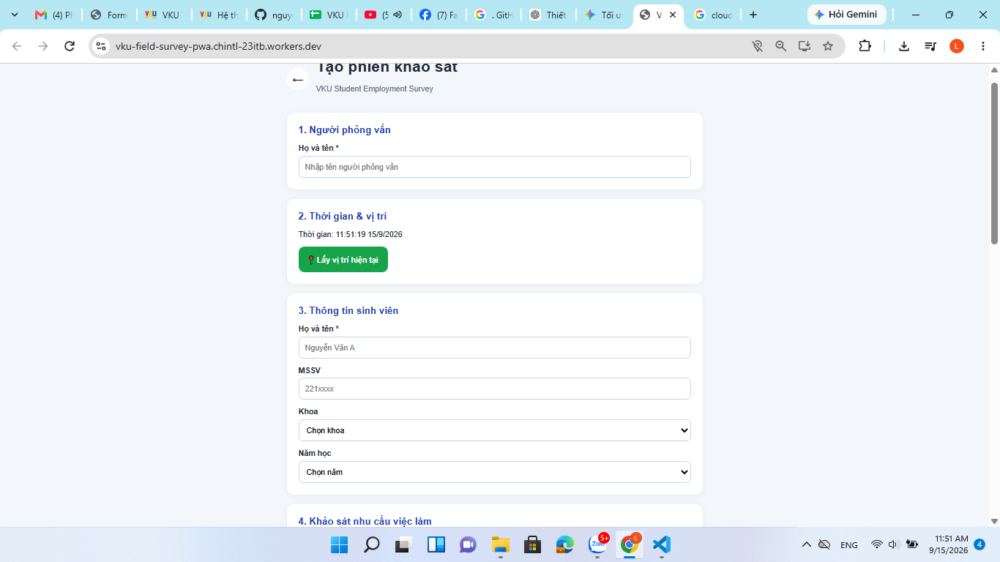
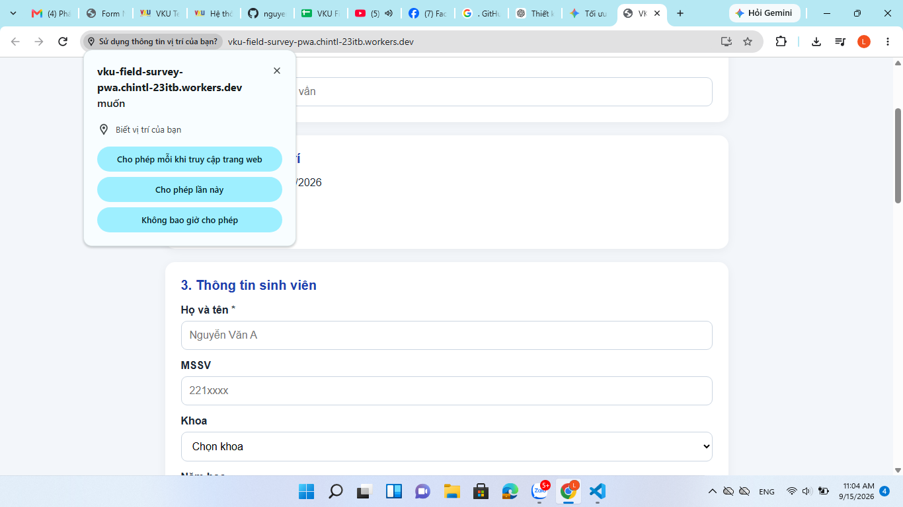
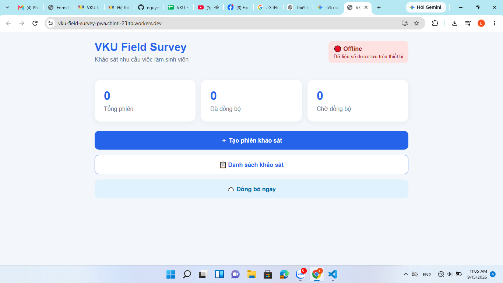
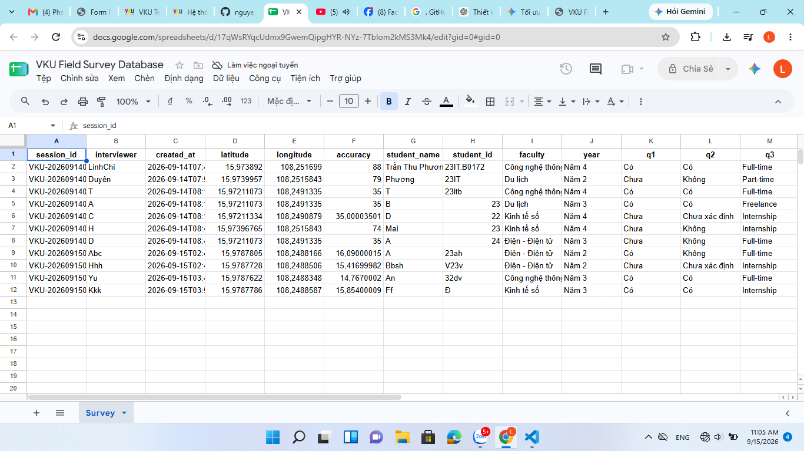

# VKU Field Survey PWA — Khảo sát nhu cầu việc làm sinh viên

> **Mini-Project 1** — Môn học: **Cross-Platform Mobile App Development (VKU)**  
> **Sinh viên thực hiện:** Nguyễn Thị Linh Chi — MSSV: `23IT.B018`  
> **Vai trò:** Full-stack Developer (Đóng góp: 100%)  
> **Demo Live:** [vku-field-survey-pwa.chintl-23itb.workers.dev](https://vku-field-survey-pwa.chintl-23itb.workers.dev/)  
> **Repository:** [nguyenlinchi/vku-field-survey-pwa](https://github.com/nguyenlinchi/vku-field-survey-pwa) 

---

# 1. Giới thiệu

**VKU Field Survey PWA** là ứng dụng Progressive Web App được xây dựng nhằm hỗ trợ thu thập dữ liệu khảo sát về **nhu cầu việc làm của sinh viên VKU**.
Ứng dụng được thiết kế theo mô hình **Offline-first**, cho phép người khảo sát thực hiện khảo sát ngay cả khi thiết bị không có kết nối Internet.
Dữ liệu khảo sát được lưu tạm trên thiết bị bằng **IndexedDB**. Khi thiết bị kết nối Internet trở lại, hệ thống sẽ tự động đồng bộ dữ liệu lên **Google Sheets**.
Đối với ảnh khảo sát, ảnh được lưu offline trên thiết bị, sau đó được upload lên **Google Drive** khi có Internet. Google Sheets chỉ lưu **URL của ảnh** để tham chiếu.

### Luồng hoạt động tổng quát
Người khảo sát
      │
      ▼
 VKU Field Survey PWA
      │
      ├── Survey Information
      ├── GPS Location
      └── Photo
              │
              ▼
          IndexedDB
              │
         Offline / Online
              │
              ▼
      Automatic Sync
              │
              ▼
      Google Apps Script
          │         │
          ▼         ▼
   Google Sheets  Google Drive
       │               │
       │               ▼
       └────────── Photo URL
```
# 2. Mục tiêu
Ứng dụng được xây dựng nhằm:

* Thu thập thông tin khảo sát sinh viên tại VKU.
* Hỗ trợ thực hiện khảo sát khi không có Internet.
* Lưu dữ liệu khảo sát trên thiết bị khi offline.
* Tự động đồng bộ dữ liệu khi Internet được khôi phục.
* Thu thập vị trí GPS tại thời điểm khảo sát.
* Chụp hoặc chọn ảnh trong quá trình khảo sát.
* Lưu ảnh offline bằng IndexedDB.
* Upload ảnh lên Google Drive khi có Internet.
* Lưu URL ảnh vào Google Sheets.
* Theo dõi trạng thái Online/Offline.
* Hiển thị thông báo khi trạng thái mạng thay đổi.
* Có thể cài đặt ứng dụng dưới dạng PWA trên thiết bị.

# 3. Chức năng chính
## 3.1. Tạo phiên khảo sát
Người khảo sát có thể tạo một phiên khảo sát mới.
Thông tin bao gồm:

* Mã phiên khảo sát (`sessionId`).
* Tên người khảo sát.
* Thời gian thực hiện.
* Thông tin sinh viên.
* Nội dung khảo sát.
* Ảnh khảo sát.
* Vị trí GPS.

Mỗi phiên khảo sát được gắn với một `sessionId` riêng để hạn chế dữ liệu bị trùng khi đồng bộ.

## 3.2. Lấy vị trí GPS
Ứng dụng sử dụng **Geolocation API** để lấy vị trí của thiết bị.
Các thông tin được thu thập:

* Latitude.
* Longitude.
* Accuracy.

Ví dụ:
Latitude: 16.xxxx
Longitude: 108.xxxx
Accuracy: 10 meters
Vị trí được lưu cùng với dữ liệu khảo sát.
Chức năng này giúp xác định vị trí nơi khảo sát được thực hiện.

## 3.3. Khảo sát nhu cầu việc làm
Ứng dụng cung cấp form khảo sát về nhu cầu việc làm của sinh viên VKU.
Thông tin có thể bao gồm:
* Họ và tên sinh viên.
* MSSV.
* Khoa.
* Năm học.
* Tình trạng tìm việc.
* Nhu cầu tìm việc.
* Hình thức làm việc mong muốn.
* Mức lương mong muốn.
* Kỹ năng cần được hỗ trợ.
* Ý kiến khác.

## 3.4. Chụp và lưu ảnh
Người khảo sát có thể chụp ảnh trực tiếp bằng camera hoặc chọn ảnh từ thiết bị.
Quy trình xử lý ảnh:


Camera / File
      ↓
Image Compression
      ↓
Blob
      ↓
IndexedDB
      ↓
Internet Available
      ↓
Base64
      ↓
Google Apps Script
      ↓
Google Drive
      ↓
Photo URL
      ↓
Google Sheets

Ảnh được nén trước khi lưu/upload nhằm giảm kích thước dữ liệu.

# 4. Offline-first
Đây là chức năng quan trọng của **VKU Field Survey PWA**.
Khi không có Internet, người dùng vẫn có thể:
* Mở ứng dụng.
* Tạo khảo sát.
* Nhập dữ liệu.
* Lấy GPS.
* Chụp ảnh.
* Lưu khảo sát.

Dữ liệu được lưu cục bộ bằng **IndexedDB**.

### Trạng thái khảo sát

pending
   ↓
syncing
   ↓
synced


Nếu đồng bộ thất bại:
pending
   ↓
syncing
   ↓
error

### Ý nghĩa trạng thái

| Status    | Ý nghĩa                  |
| --------- | ------------------------ |
| `pending` | Dữ liệu đang chờ đồng bộ |
| `syncing` | Đang đồng bộ             |
| `synced`  | Đồng bộ thành công       |
| `error`   | Đồng bộ thất bại         |

Dữ liệu không bị xóa khỏi IndexedDB nếu quá trình đồng bộ thất bại.

# 5. Technical Architecture & Project Structure
## 5.1. Kiến trúc hệ thống
Ứng dụng sử dụng kiến trúc **Offline-first**.

                     React PWA
                         │
        ┌────────────────┼────────────────┐
        │                │                │
        ▼                ▼                ▼
    Survey Form      GPS Location     Photo Capture
        │                │                │
        └────────────────┼────────────────┘
                         ▼
                     IndexedDB
                         │
                 Survey + Photo
                         │
                  Network Status
                    /          \
                   /            \
              Offline          Online
                │                 │
                │                 ▼
                │          Automatic Sync
                │                 │
                │                 ▼
                │        Google Apps Script
                │             /       \
                │            /         \
                │           ▼           ▼
                │    Google Sheets   Google Drive
                │         │              │
                │         │              ▼
                │         │           Photo URL
                │         │              │
                └─────────┴──────────────┘
                         │
                         ▼
                    Sync Complete
```

## 5.2. Luồng xử lý dữ liệu
Khi người dùng tạo khảo sát:

Create Survey
      ↓
Input Information
      ↓
Get GPS
      ↓
Capture Photo
      ↓
Compress Photo
      ↓
Save to IndexedDB
      ↓
Check Network
```

Nếu offline:

Offline
   ↓
Status = pending
   ↓
Wait for Internet


Nếu online:


Online
   ↓
Sync
   ↓
Google Apps Script
   ↓
Google Sheets + Google Drive
   ↓
Status = synced
```

## 5.3. Cấu trúc thư mục

vku-field-survey-pwa/
│
├── public/
│   ├── icons/
│   ├── screenshots/
│   └── manifest.webmanifest
│
├── src/
│   │
│   ├── components/
│   │   └── NetworkStatus.jsx
│   │
│   ├── pages/
│   │   ├── NewSurvey.jsx
│   │   └── SurveyList.jsx
│   │
│   ├── services/
│   │   ├── image.js
│   │   └── sync.js
│   │
│   ├── db.js
│   ├── App.jsx
│   ├── main.jsx
│   └── index.css
│
├── .env
├── .gitignore
├── index.html
├── package.json
└── README.md

## 5.4. Vai trò của các thành phần

| File / Folder          | Chức năng                              |
| ---------------------- | -------------------------------------- |
| `App.jsx`              | Quản lý giao diện chính                |
| `NewSurvey.jsx`        | Tạo và nhập dữ liệu khảo sát           |
| `SurveyList.jsx`       | Hiển thị các phiên khảo sát            |
| `db.js`                | Lưu/đọc dữ liệu từ IndexedDB           |
| `sync.js`              | Đồng bộ dữ liệu với Google Apps Script |
| `image.js`             | Nén và xử lý ảnh                       |
| `NetworkStatus.jsx`    | Theo dõi trạng thái Online/Offline     |
| `main.jsx`             | Khởi chạy React                        |
| `index.css`            | Style giao diện                        |
| `manifest.webmanifest` | Cấu hình PWA                           |
| `public/icons/`        | Icon ứng dụng                          |
| `public/screenshots/`  | Ảnh minh chứng cho README              |

## 5.5. State Management Flow
Mỗi khảo sát được quản lý theo trạng thái:

NEW
 │
 ▼
pending
 │
 │ Internet available
 ▼
syncing
 │
 ├──────────────┐
 │              │
 ▼              ▼
synced         error
 │              │
 ▼              ▼
Completed      Retry
```

Dữ liệu chỉ được đánh dấu `synced` sau khi Google Apps Script xác nhận quá trình lưu thành công.


## 5.6. Exception Handling
### Mất Internet

Offline
   ↓
Không gửi request
   ↓
Lưu IndexedDB
   ↓
pending
```

### Upload ảnh thất bại

Upload Failed
     ↓
Giữ dữ liệu trong IndexedDB
     ↓
error
     ↓
Retry

### Không lấy được GPS

Ứng dụng hiển thị thông báo yêu cầu người dùng:

* Kiểm tra quyền truy cập vị trí.
* Bật Location/GPS.
* Thử lấy vị trí lại.

### Google Apps Script lỗi

Dữ liệu vẫn được giữ trong IndexedDB và có thể được đồng bộ lại sau.

### Trùng dữ liệu

Mỗi khảo sát có `sessionId` riêng. Google Apps Script kiểm tra `sessionId` trước khi thêm dữ liệu vào Google Sheets để hạn chế duplicate records.

---

# 6. Đồng bộ dữ liệu

Ứng dụng sử dụng **Google Apps Script** làm API trung gian.

Luồng đồng bộ:

```text
React PWA
    │
    ▼
IndexedDB
    │
    │ Internet Available
    ▼
Google Apps Script
    │
    ├───────────────┐
    ▼               ▼
Google Sheets   Google Drive
                    │
                    ▼
                 Photo URL
                    │
                    ▼
              Google Sheets
```

Mỗi phiên khảo sát tương ứng với một dòng trong Google Sheets.

---

# 7. Lưu ảnh lên Google Drive

Ảnh **không được lưu trực tiếp vào Google Sheets**.
Google Drive được sử dụng để lưu file ảnh.
Google Sheets chỉ lưu URL của ảnh.

### Google Drive

VKU Field Survey Photos/
│
├── SURVEY-001.jpg
├── SURVEY-002.jpg
└── SURVEY-003.jpg
```

### Google Sheets

| Session ID | Interviewer         | Latitude | Longitude | Photo URL        |
| ---------- | ------------------- | -------- | --------- | ---------------- |
| SURVEY-001 | Nguyễn Thị Linh Chi | 16.xxx   | 108.xxx   | Google Drive URL |
| SURVEY-002 | Nguyễn Thị Linh Chi | 16.xxx   | 108.xxx   | Google Drive URL |

---

# 8. Google Sheets
Google Sheets được sử dụng làm nơi lưu trữ dữ liệu khảo sát.
Các trường dữ liệu chính:

```text
session_id
interviewer
created_at
latitude
longitude
accuracy
student_name
student_id
faculty
year
q1
q2
q3
q4
q5
q6
q7
q8
photo_url
sync_time
```

Mỗi phiên khảo sát tương ứng với một record trong Google Sheets.

---
## 9. Trạng thái mạng & Thông báo
Ứng dụng tự động theo dõi kết nối mạng thời gian thực và phát thông báo qua **Notification API**:

* **🟢 Online:** Tự động đồng bộ các phiếu khảo sát ở trạng thái `pending` lên Google Sheets và upload ảnh lên Google Drive.
  * *Thông báo:* `🟢 Đã kết nối Internet. Đang đồng bộ dữ liệu...`
  * *Khi hoàn tất:* `✅ Đồng bộ khảo sát thành công.`
* **🔴 Offline:** Cho phép tiếp tục tạo khảo sát bình thường, dữ liệu và ảnh được lưu an toàn vào `IndexedDB`.
  * *Thông báo:* `🔴 Bạn đang offline. Dữ liệu sẽ được lưu trên thiết bị.`
# 11. Empirical Evidence & Screenshots
Phần này cung cấp bằng chứng thực tế về các chức năng chính của ứng dụng.
## 11.1. Screenshot 1 – Survey Form
**Mục đích:** Chứng minh chức năng tạo phiên khảo sát.
Ảnh nên thể hiện:
* Tên người khảo sát.
* Thông tin sinh viên.
* Các câu hỏi khảo sát.
* Nút lưu khảo sát.


*Figure 1. Giao diện tạo phiên khảo sát.*

## 11.2. Screenshot 2 – GPS & Photo

**Mục đích:** Chứng minh chức năng lấy GPS và chụp/chọn ảnh.
Ảnh nên thể hiện:
* Latitude.
* Longitude.
* Accuracy.
* Ảnh khảo sát.
* Giao diện form.



*Figure 2. Chức năng lấy vị trí GPS và ảnh khảo sát.*

---

## 11.3. Screenshot 3 – Offline Mode

**Mục đích:** Chứng minh ứng dụng vẫn hoạt động khi không có Internet.


*Figure 3. Ứng dụng hoạt động trong chế độ Offline.*

---

## 11.4. Screenshot 4 – Synchronization

**Mục đích:** Chứng minh dữ liệu được đồng bộ sau khi Internet được khôi phục.

Google Sheets hiển thị dữ liệu khảo sát và URL ảnh.

Google Drive chứa ảnh tương ứng.


*Figure 4. Kết quả đồng bộ dữ liệu và ảnh.*

---
## 11.5. Evidence Summary

| Screenshot | Chức năng chứng minh                          |
| ---------- | --------------------------------------------- |
| Figure 1   | Tạo và nhập khảo sát                          |
| Figure 2   | GPS và chụp ảnh                               |
| Figure 3   | Offline-first và IndexedDB                    |
| Figure 4   | Automatic Sync, Google Sheets và Google Drive |

# 12. Công nghệ sử dụng
## Frontend
* React
* Vite
* JavaScript
* HTML5
* CSS3
## PWA
* Service Worker
* Web App Manifest
* IndexedDB
* Offline-first Architecture
## API / Backend
* Google Apps Script
## Database
* Google Sheets
## File Storage
* Google Drive
## Deployment
* Cloudflare
## Version Control

* Git
* GitHub

---
# 13. Cài đặt và chạy project
## Bước 1: Clone project

```bash
git clone https://github.com/nguyenlinchi/vku-field-survey-pwa.git
```
## Bước 2: Di chuyển vào project

```bash
cd vku-field-survey-pwa
```

## Bước 3: Cài đặt dependencies

```bash
npm install
```

## Bước 4: Chạy project

```bash
npm run dev
```

Nếu PowerShell chặn `npm`:

```bash
npm.cmd run dev
```
Vite sẽ cung cấp địa chỉ localhost để truy cập ứng dụng.
---
# 14. Cấu hình Google Apps Script

Tạo file `.env`:

```env
VITE_GOOGLE_SCRIPT_URL=https://script.google.com/macros/s/YOUR_SCRIPT_ID/exec
```

Không commit file `.env` lên GitHub.

`.gitignore`:

```text
.env
.env.local
node_modules/
dist/
```

---

# 15. Deployment
Project được build và triển khai trên **Cloudflare**.
### Build

```bash
npm run build
```

Thư mục build:

```text
dist/
```

### Cloudflare configuration
Framework preset: Vite
Build command: npm run build
Build output directory: dist
```
Live Demo:https://vku-field-survey-pwa.chintl-23itb.workers.dev/
Ứng dụng được triển khai bằng HTTPS nên có thể sử dụng các tính năng yêu cầu secure context như GPS và PWA.
---
# 16. Ưu điểm
* Hoạt động được khi mất Internet.
* Không mất dữ liệu khảo sát khi offline.
* Hỗ trợ GPS.
* Hỗ trợ camera.
* Lưu ảnh offline.
* Tự động đồng bộ khi có mạng.
* Lưu ảnh trên Google Drive.
* Google Sheets dễ quản lý dữ liệu.
* Có thể cài đặt trên điện thoại như ứng dụng.
* Không cần xây dựng backend server riêng.

---
# 17. Hạn chế
* Cần quyền truy cập vị trí.
* Cần quyền camera.
* Google Apps Script có giới hạn về request và dung lượng.
* Ảnh cần được nén trước khi upload.
* Phụ thuộc vào Google Sheets và Google Drive khi đồng bộ.
* Cần xử lý trường hợp mạng thay đổi trong quá trình đồng bộ.
* Khi sử dụng thực tế cần xem xét quyền truy cập và bảo mật dữ liệu khảo sát.

---
# 18. Technical Challenges & Resolutions
## Challenge 1 – Lưu dữ liệu khi Offline
### Problem
Nếu ứng dụng gửi dữ liệu trực tiếp lên Google Sheets khi mất Internet, request sẽ thất bại và dữ liệu có nguy cơ bị mất.
### Resolution
Sử dụng IndexedDB để lưu dữ liệu cục bộ.
Dữ liệu chỉ được đánh dấu `synced` sau khi đồng bộ thành công.

---
## Challenge 2 – Lưu và đồng bộ ảnh Offline
### Problem
Ảnh không thể upload lên Google Drive khi thiết bị offline và có kích thước lớn hơn dữ liệu text.
### Resolution
Ảnh được:

1. Nén.
2. Lưu dưới dạng Blob trong IndexedDB.
3. Chờ Internet.
4. Chuyển sang Base64.
5. Gửi tới Google Apps Script.
6. Upload lên Google Drive.
7. Lấy URL.
8. Lưu URL vào Google Sheets.

## Challenge 3 – Tránh dữ liệu trùng
### Problem
Khi mạng không ổn định, một request có thể được gửi lại nhiều lần.

### Resolution
Mỗi survey có `sessionId` duy nhất.
Google Apps Script kiểm tra `sessionId` trước khi tạo record mới.

# 19. Hướng phát triển
Trong tương lai, ứng dụng có thể được mở rộng:
* Đăng nhập người khảo sát.
* Quản lý nhiều loại khảo sát.
* Dashboard thống kê.
* Biểu đồ nhu cầu việc làm.
* Tìm kiếm và lọc khảo sát.
* Xuất báo cáo Excel/PDF.
* Đồng bộ hai chiều.
* Mã hóa dữ liệu offline.
* Xác thực người dùng.
* Quản lý quyền truy cập Google Drive.
* Đóng gói PWA thành Android APK bằng Capacitor.

---

## 📝 Thông tin đồ án

- **Trường:** Đại học CNTT & TT Việt - Hàn (VKU)
- **Môn học:** Cross-Platform Mobile App Development
- **Đề tài:** Mini-Project 1 — VKU Field Survey PWA
- **Ngày nộp báo cáo:** 15/09/2026
